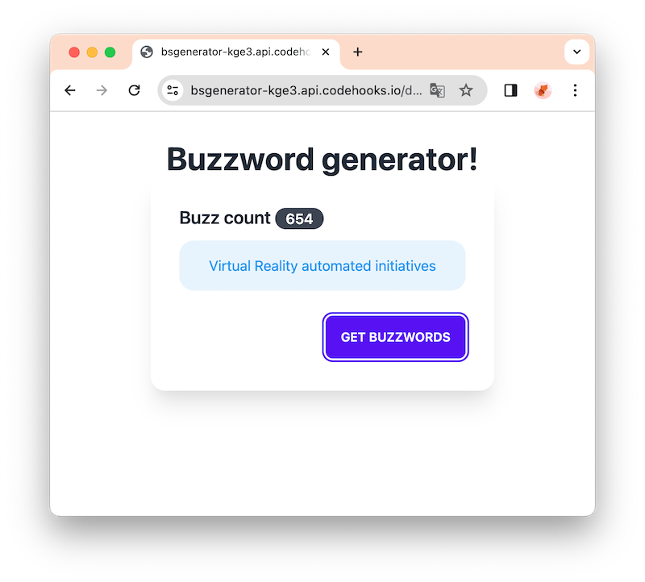

# Example Web App using DaisyUI, Alpine.js and codehooks.io

[Read the full tutorial at Dev.to here](https://dev.to/restdbjones/daisyui-alpinejs-codehooksio-the-simple-web-app-trio-4lad)



[Link to live example.](https://bsgenerator-kge3.api.codehooks.io/dev)

## Project Setup

Clone the Codehooks examples repo, then move into the sub folder for this project and install npm dependencies.
```
git clone https://github.com/RestDB/codehooks-io-examples.git

cd codehooks-io-examples/bsgenerator

npm install
```

## Codehooks.io Account Setup

Next you'll need to connect the local project directory to your Codehooks.io project space.

[Sign up for an account](https://account.codehooks.io/login?signup) at Codehooks.io, and create a new project, e.g. mywebapp. 

Install the Codehooks.io CLI.
```bash
npm install -g codehooks
``` 

Login to your account.
```bash
coho login
```

Connect your local web app project with your account/project.
```bash
coho init --empty
```

## Deploy

To deploy the complete web app and the backend API run:

```bash
npm run deploy
```

Check your project URL, in my example it's `https://bsgenerator-kge3.api.codehooks.io/dev`

```bash
coho info
```
