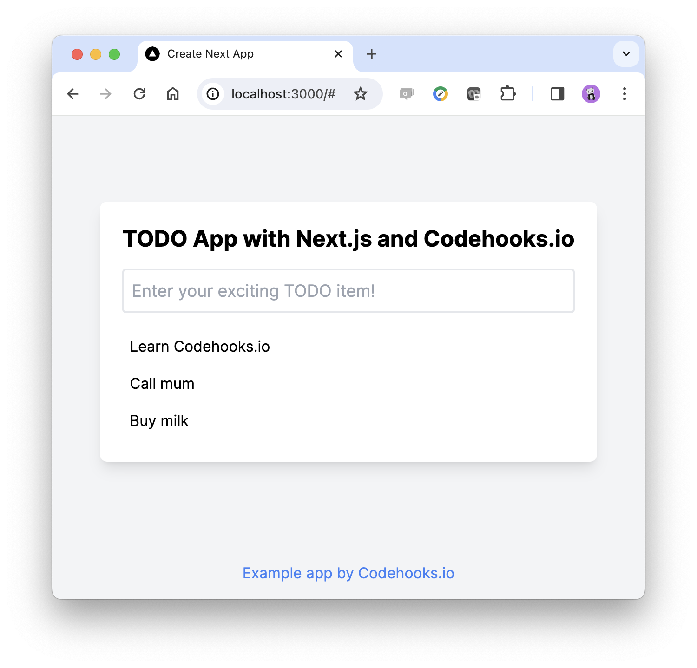

# Next.js and Codehooks.io Todo App</h3>

Create a todo app with Next.js using Codehooks.io NoSQL database backend API. 

This is a [Next.js](https://nextjs.org/) project created by using the [`create-next-app`](https://github.com/vercel/next.js/tree/canary/packages/create-next-app) utility.

## Getting Started

First create a Codehooks.io backend CRUD project, follow [the quick start guide](https://codehooks.io/docs/quickstart-cli). 
Then add your Codehooks project URL and API token in the `.env.local` file. Get you project domain and API token from the project dashboard or with the CLI command `coho info`

An example `.env.local` file is shown below:

```bash
SERVER_URL=https://mystical-dolphin-4167.codehooks.io/todo
API_TOKEN=a3ec4989-2yda-2hhe-a66c-cb743bd8a665
```

Now, run the local next.js development server:

```bash
npm run dev
```

Open [http://localhost:3000](http://localhost:3000) with your browser to see the result similar to the example screenshot shown below.



You can start editing the page by modifying `app/page.js`. The page auto-updates as you edit the file.


## Learn More

To learn more about Next.js, take a look at the following resources:

- [Next.js Documentation](https://nextjs.org/docs) - learn about Next.js features and API.
- [Learn Next.js](https://nextjs.org/learn) - an interactive Next.js tutorial.

You can check out [the Next.js GitHub repository](https://github.com/vercel/next.js/) - your feedback and contributions are welcome!

## Deploy on Vercel

The easiest way to deploy your Next.js app is to use the [Vercel Platform](https://vercel.com/new?utm_medium=default-template&filter=next.js&utm_source=create-next-app&utm_campaign=create-next-app-readme) from the creators of Next.js.

Check out our [Next.js deployment documentation](https://nextjs.org/docs/deployment) for more details.
