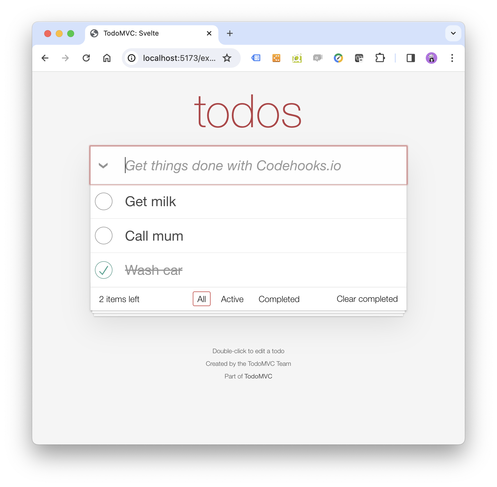

# Svelte todo app using Codehooks.io data backend

## Description

This application uses Svelte to implement a todoMVC application. The todo items are persisted to a Codehooks.io data backend using the standard CRUD REST API from a new Codehooks.io project.

-   [Svelte](https://svelte.dev/) is a tool for building fast web applications. It is similar to JavaScript frameworks such as React and Vue, which share a goal of making it easy to build slick interactive user interfaces.
- [Codehooks.io](https://codehooks.io) is a quick API and data backend. Codehooks.io has a very easy start default with a NoSQL CRUD REST API, and has the flexibility and power for more advanced development as you grow.

This app is a modification of the [Svelte Todomvc app](https://todomvc.com). The original [source code can be found here](https://github.com/tastejs/todomvc/tree/master/examples/svelte).

The finished result of the app is shown in the screenshot below.



## Getting started

First you need to sign up for an account at [Codehooks.io](https://codehooks.io).

When logged into your account, create new project.
In the new project `dev` environment, create a new API token (Admin menu).
Copy the project domain name (Home menu) and API token into the [src/codehooksDB.js](./src/codehooksDB.js) file.

## Build steps

```
npm install
```

```
npm run build
```

## Requirements

The only requirement is an installation of Node (min version 18), to be able to install dependencies and run scripts to serve a local server.


## Local preview

```
npm run dev
```

Typically you should see this in your console:

```

> todomvc-svelte@1.0.0 dev
> vite dev --host

(!) "base" option should start with a slash.
Forced re-optimization of dependencies

  VITE v4.4.9  ready in 461 ms

  ➜  Local:   http://localhost:5173/examples/svelte/dist/
```

Navigate to the localhost address in your browser to verify.

Happy coding 🙌